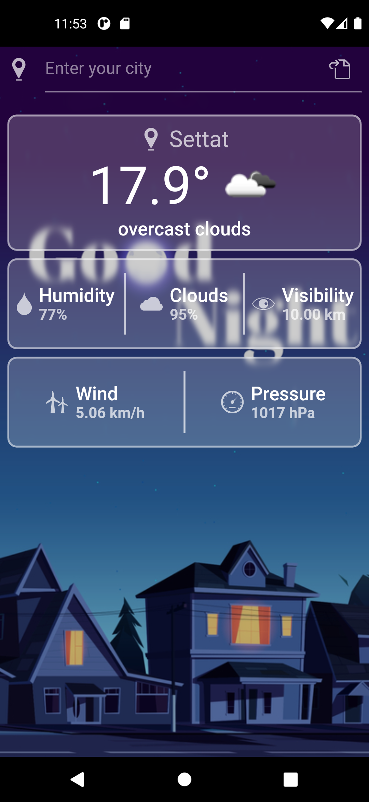
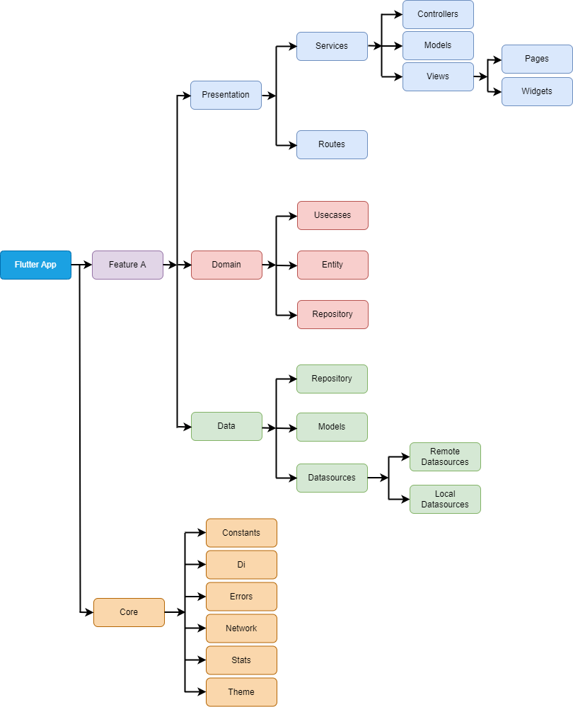

# Flutter_clean_architecture_template

Choosing Flutter as the SDK for developing products with fast iterations is the right choice. 
However, when choosing Flutter, developers should also start thinking about how to organize 
the state management of the app and how to design the app (behind the scenes) to be maintainable, scalable and testable.
To address these concerns, we need to design the architecture of the application before starting to develop the features.
a
In general there are multiple approaches out there dividing an application into different independent layers. 
The most common one is the classic three layer architecture: Presentation layer, domain layer and data layer.
* Presentation Layer: contains UI and Presenters
* Domain Layer: contains Use Cases and Entities
* Data Layer: contains Repositories and Data Sources

Clean Architecture overview and its request/response data flow inspired by Reso Coder’s Flutter Clean Architecture Proposal²

## Data Flow

This app fetches the weather of a city from remote API and display them in the UI. 
Should any error happen, the application will properly reflect them in the UI.
Let us take a look at the data flow of this app example:
* View calls method in presentation logic (view model, presenter or similar)
* Presentation logic executes one or more use cases
* Use case calls repository to fetch data
* Repository fetches data from data sources (cached or remote) and returns domain entity
* Use case handles errors that might occur and returns domain entity that should be displayed
* UI displays data
As you can see, the whole data flows from presentation layer through domain layer to data layer and then back to the presentation layer.

## Simple Application

## Project Structure

When starting a new application from scratch, the first questions you may ask is how should the project 
be structured? There are two different approaches how to structure your project.

First approach:

Second approach:

in this application sample i have used the second approach.

as you can see i have added one aditional layer to the three ones in the top:
* Presentation Layer: contains UI and Presenters
* Domain Layer: contains Use Cases and Entities
* Data Layer: contains Repositories and Data Sources
* Core Layer: contains all shared data on the whole application
